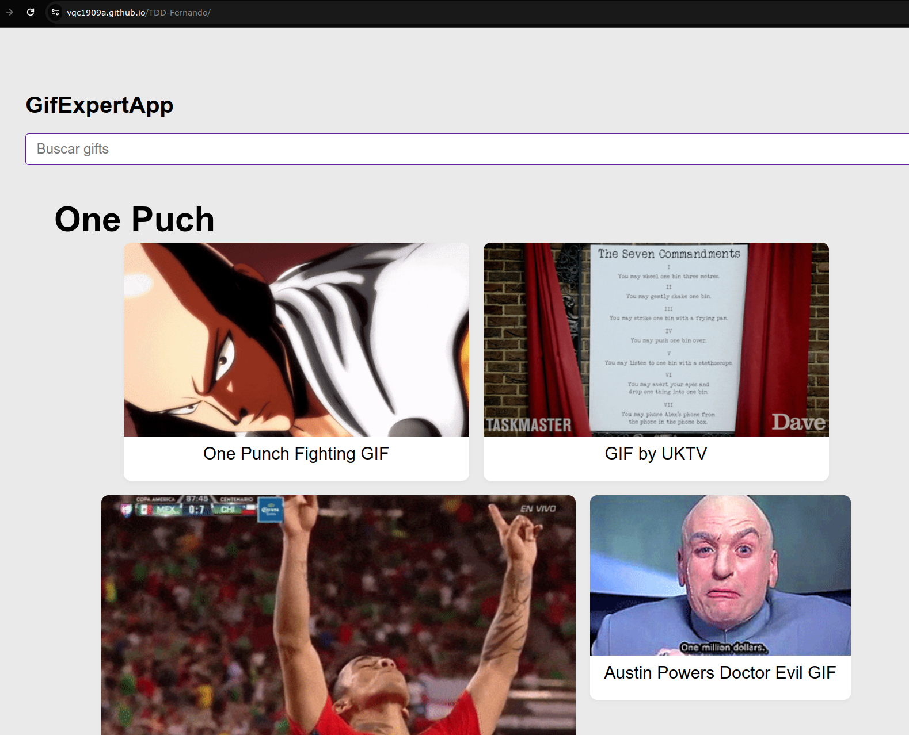

# Public my App to Github Pages
To following to show the steps to get it

* Copy and change the name build folder to 'docs'(it's recommended) or anything   
* Inside folder, change the absolute paths to relative path of the index.html file 
* Upload your Project to Github
* Open the tab 'Settings', after open the tab aside 'Pages' of your project
* Select the branch and the folder to upload the folder at the Web
* Finally, click on the Save and wait a few pair minutes

## Results 
